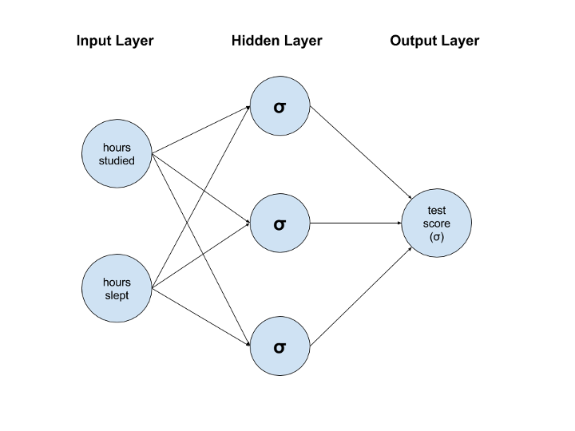

## Exercise 2: Building the neural network

We will use a single hidden layer in our neural network. Initially, let's put three nodes into that layer, but we can later play around with that number to see its effect on the trained model. Here's how our network will look once we are done with this exercise.

The good thing about neural networks is that they are easy to model using a series of tensors (in this case, matrices). Let's start by defining the structure in the diagram above.

### Step 1:
Define the following three variables:
* **num_neurons_1**: Number of neurons in the input layer. Also known as the number of features. This is fixed by our dataset.
* **num_neurons_2**: Number of neurons in the hidden layer. We can play around with this to see how it affects the trained model.
* **num_neurons_3**: Number of neurons in the output layer. For this type of problem where we are predicting a single value (test score), there can only be one output neuron.

### Step 2:
There are six lines going from the input layer to the hidden layer. Each of these has a weight associated with it. We need to define a matrix that holds all six weights. This matrix should be in a form that we can use to do matrix multiplication with the input tensor we defined in **Exercise 1**. The result of that matrix multiplication will give us the weighted sums per example per hidden layer node. There is a lot to take in here, so stop to make sure you understand what's going on. Ask questions if you don't.

**Hint: An easy way to think about the dimensions of the weight array that we need is to use the number of nodes in the input layer as the size of the first dimension and the number of nodes in the hidden layer as the size of the second dimension.**

Remember that the weights are the parts of the model that change, so we need to define a tf.Variable here ([documentation](https://www.tensorflow.org/api_docs/python/tf/Variable)). You can either use zeros ([documentation](https://www.tensorflow.org/api_docs/python/tf/zeros) or random numbers ([documentation](https://www.tensorflow.org/api_docs/python/tf/random_normal)) as initial values. Call this matrix **weights_1** since we will have another matrix connecting the hidden layer with the output layer.

### Step 3:
We need a bias term for the hidden layer. This is just a single value for each node in the layer. So define a 1x3 variable (again with initial value either zeros or random numbers from a normal distribution) and call it **bias_1**. You're doing great. **Remember to ask questions if something is unclear.**

### Step 4:
Use matrix multiplication to multiply the normalized input (from **Exercise 1**) by **weights_1**. Add to it **bias_1** and store it in **weighted_sums_1** ([documentation](https://www.tensorflow.org/api_docs/python/tf/matmul)).

### Step 5:
Apply the sigmoid activation function to the weighted sums computed in **Step 4**. The function is the same across all the neurons, so we can just pass in the whole matrix and it will run the computation element-wise ([documentation](https://www.tensorflow.org/api_docs/python/tf/sigmoid)). Call the resulting tensor **activation_1**. **Okay, take a deep breath!**

### Step 6:
Now, we're going to repeat **Steps 2 through 5** for the connections between the hidden layer and the output layer. Start with defining **weights_2** as a 2-dimensional TensorFlow variable. To determine the size in each dimension, go back and read the hint in **Step 2**.

### Step 7:
Define **bias_2** as a TensorFlow variable like we did in **Step 3**. There's only 1 node in the output layer, so this variable should be 1-dimensional.

### Step 8:
Use matrix multiplication to multiply the output of the hidden layer (**activation_1**) by **weights_2**. Add **bias_2** to it and store it in **weighted_sums_2**. We're almost done with the neural network!

### Step 9:
Apply the sigmoid activation function to **weighted_sums_2** and store it in **activation_2** (like you did in **Step 5**). Note that **activation_2** is the **_final output_** of this neural network.

**We're done building up the neural network. Woohoo! Now let's define a loss function and train the model.**